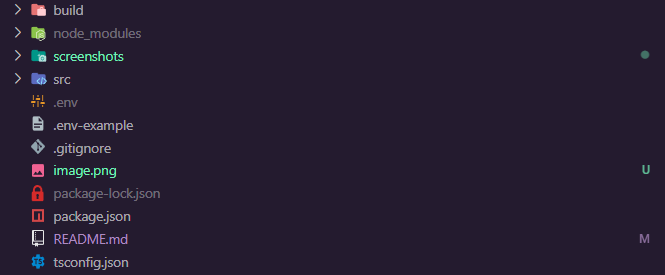
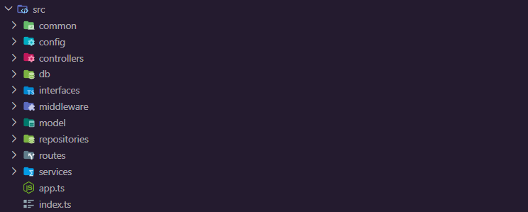

# Primer Proyecto Back-End con NodeJS by: @DatBrian

## Descripción del proyecto:
#### Proyecto de práctica en el que se realizó la implementación de un Back-End completo hecho con Node.JS el cual administra una base de datos relacional en una ejemplificación de un inventariado de negocio con bodegas, productos entre otros.

---

## Técnologías utilizadas:
#### Para este proyecto se utilizó el entorno de ejecución **NodeJS** con su framework [ExpressJS](https://expressjs.com/). Para la base de datos se utilizó **MySQL** y la librería [mysql2](https://github.com/sidorares/node-mysql2) para la implementación de la misma en el código y todo el código está en **TypeScript** para proporcionar un tipado estático.
##### (El resto de dependencias se podrán visualizar en el archivo package.json que en su mayoría son de desarrollo ya que las necesarias para producción son las que se mencionan anteriormente.)

---

## Estructura y Configuración:
### **Directorio Raíz:**
#### En el directorio raíz se encuentran los archivos principales de configuración sin entrar aún al código.
#### 
- #### Dentro de la carpeta [build](build) se encuentra todo el código TypeScript transpilado a JavaScript.

- #### La carpeta [node_modules](node_modules) es la que se creará al inicializar el proyecto y contiene todas los archivos necesarios para las dependencias que se vayan a utilizar.

- #### La carpeta [src](src) contiene todo el código del proyecto.

- #### El archivo .env-example es el que se utilizará más adelante para configurar las variables de entorno.

- #### El archivo [package.json](package.json) al igual que la carpeta [node_modules](node_modules) se creará automáticamente al inicializar el proyecto y aqui se podrán realizar configuraciones del mismo y de las dependencias que este contiene.

- #### El archivo [tsconfig.json](tsconfig.json) es el archivo que contiene todas las configuraciones necesaarias para que **TypeScript** funcione correctamente.

### **Carpeta del proyecto ([src](src)):**

- `app.ts`: Archivo principal que configura la aplicación Express y establece las rutas y middlewares.
- `common/`: Carpeta que contiene funciones comunes y una clase de enrutador común.
- `config/`: Carpeta que contiene archivos de configuración, como `ConnectDataSource.ts` para la conexión a la base de datos y `EnvConfig.ts` para las variables de entorno.
- `controllers/`: Carpeta que contiene los controladores de cada entidad, como `BodegasController.ts`.
- `db/`: Carpeta que contiene la lógica de conexión a la base de datos y el manejo del datasource, como `Connection.ts` y `DataSource.ts`.
- `interfaces/`: Carpeta que contiene las interfaces utilizadas en el proyecto, como `RoutesInterface.ts`.
- `middlewares/`: Carpeta que contiene los middlewares utilizados en las rutas, como `ValidateMiddlewareDTO.ts`.
- `model/`: Carpeta que contiene los modelos de datos, como DTO y entidades.
- `model/dto/`: Carpeta que contiene los objetos de transferencia de datos (DTO), como `BodegasDTO.ts`.
- `model/entities/`: Carpeta que contiene las entidades del dominio, como `BodegasEntity.ts`.
- `repositories/`: Carpeta que contiene los repositorios de datos, como `BodegasRepository.ts`.
- `routes/`: Carpeta que contiene las rutas de la aplicación, como `BodegasRoutes.ts`.
- `services/`: Carpeta que contiene la lógica de negocio, como `BodegasService.ts`.
- `index.ts`: Archivo principal que inicializa la aplicación y configura las rutas.

# **EndPoints:**

- GET /api/v1/bodegas: Obtiene todas las bodegas.
- POST /api/v1/bodegas: Crea una nueva bodega.

## GET:

**https://{host}:{port}/api/v1/{nombre_tabla}**

## POST:

**https://{host}:{port}/api/v1/{nombre_tabla}**